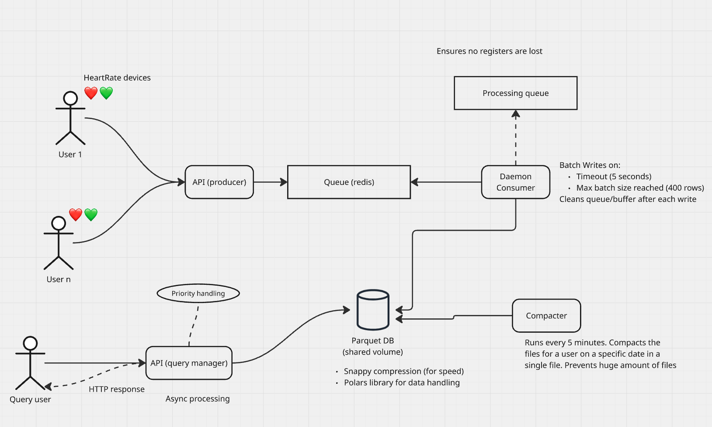

# Heart Rate Monitor System

Sistema para monitorear la frecuencia cardiaca de diferentes usuarios (cada usuario puede tener multiples dispositivos).



### Desafios
- Alta tasa de escrituras
- Optimizar queries

### Detalles tecnicos:
- Producer (FastAPI) recibe POST requests y hace `RPUSH` directamente a Redis
- Consumer lee de Redis usando `BRPOPLPUSH` (operacion atomica)
- Los datos se escriben en batches a archivos Parquet fragmentados (`part-*.parquet`)
- Un servicio compacter mergea los fragmentos en `compacted.parquet` periodicamente
- Prioridad de dispositivos solo se aplica cuando el timestamp es EXACTAMENTE el mismo
- Queries agregan datos por minuto y resuelven conflictos por prioridad de dispositivo

Flujo de registro de heartbeat:
1. Client → POST /metrics/heart-rate → Producer (FastAPI)
2. Producer → `RPUSH` a Redis lista `heartbeat:queue`
3. Consumer → `BRPOPLPUSH` mueve item a `heartbeat:processing`
4. Consumer → agrupa en batch y escribe a `part-*.parquet`
5. Consumer → `LREM` remueve de `processing` tras escritura exitosa
6. Compacter → mergea `part-*.parquet` en `compacted.parquet` periodicamente

### Como usar
Clona el repo y ejecuta:
```bash
docker-compose up
```

Los endpoints estan disponibles en http://localhost:8000

Endpoints:
- `POST /metrics/heart-rate` - registrar heartbeat
- `GET /metrics/heart-rate?user_id=X&start=Y&end=Z&device_id=W` - consultar datos
- `GET /health` - health check

### Mejoras futuras para prod
- usar SQS en lugar de Redis queue (incluir DLQ)
- escalar consumer horizontalmente
- agregar metricas y monitoring


Author: Mauricio Molina

